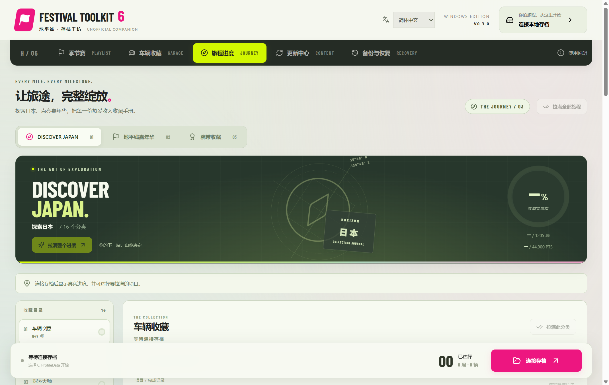
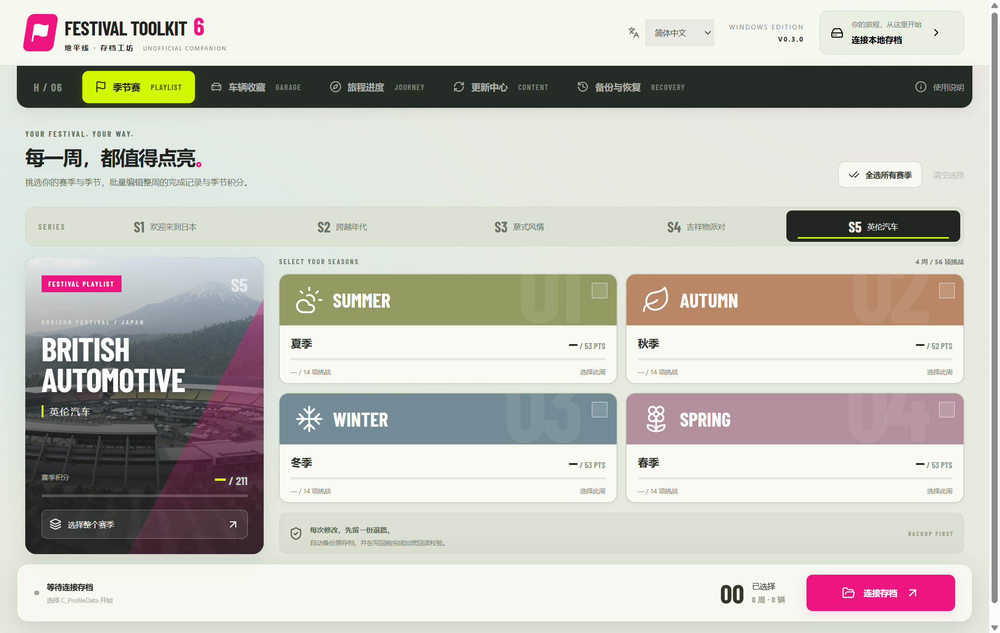
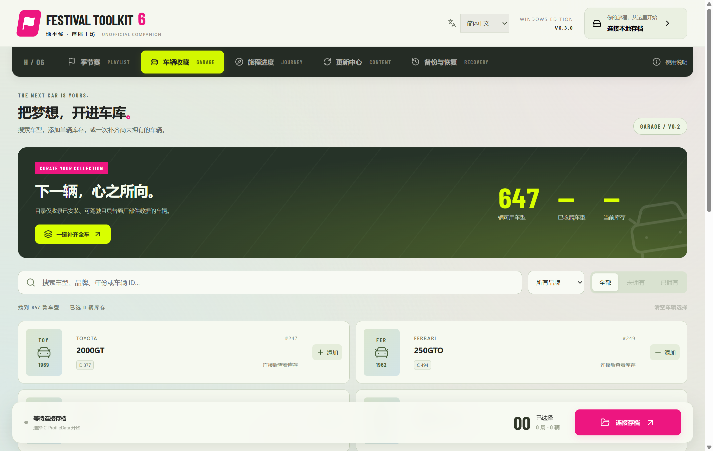

<p align="center"><b>English</b> · <a href="README.zh-CN.md">简体中文</a></p>


<p align="center"><a href="https://github.com/ChefDavid0815/horizon-festival-toolkit/releases/tag/v0.3.0"><b>DOWNLOAD 0.3.0 ↓</b></a> &nbsp; / &nbsp; <a href="https://chefzc-homepage.vercel.app/gallery.html#festival-history">VERSION JOURNAL ↗</a> &nbsp; / &nbsp; <a href="CHANGELOG.md">CHANGELOG ↗</a></p>

# Horizon Festival Toolkit · V0.3.0

A Windows workshop for FH6 journals, wristbands, playlists, car inventory and independently updatable content. Version 0.3 keeps the festival palette and adds a detailed journey workspace, coordinated motion, daily GitHub updates and release history.

| Playlist | Garage | Content | Language |
| --- | --- | --- | --- |
| Dynamic series and week selection | 647 bundled models | Local game sync + offline packs | English / 简体中文 / System |

## What you can do

- Explore Discover Japan and Horizon Festival: **38 categories and 2,833 journal entries**, with localized descriptions, search, filters and individual/category/path/all selection. Completion records and point totals update together.
- Inspect seven wristband ownership records and add one colour or every missing colour. Ownership is separate from story and race eligibility.
- Check GitHub once per local day, including published prereleases. The update dialog opens the release download page; downloading and installing remain manual.
- Browse the bilingual 0.1.1 → 0.2.0 → 0.3.0 history in the update centre. See the [0.3 guide and exact editing scope](docs/RELEASE-0.3.0.md).

- Use each series' actual in-game cover in the series poster. Covers are read from local texture archives and cached; the four season cards keep their existing styling.

- Search cars by model, make, year or ID; common Chinese make aliases work too.
- Add 1–20 copies of a selected model, including cars you already own, or add one of every missing catalog model.
- Select a week, a series or all recognized playlist records. Apply car and playlist changes together.
- Sync the catalog from local game resources. Optional checks run on launch and every 30 minutes while the app is open. Supported new content does not require a toolkit reinstall.
- Import/export independent JSON content packs and retain historical definitions.
- Keep automatic backups, verify original/SCopy independently on restore, and validate encrypted-save round trips before write-back.

The app starts disconnected and never edits a save automatically. **Back up & apply** writes the selected changes. The garage writer preserves existing cars and checks unrelated database tables and profile states.

## Run or build

**[Get the Windows x64 release](https://github.com/ChefDavid0815/horizon-festival-toolkit/releases/tag/v0.3.0)** — installer, portable app and SHA-256 checksums:

- [Horizon-Festival-Toolkit-0.3.0-Setup.exe](https://github.com/ChefDavid0815/horizon-festival-toolkit/releases/download/v0.3.0/Horizon-Festival-Toolkit-0.3.0-Setup.exe)
- [Horizon-Festival-Toolkit-0.3.0-Portable.exe](https://github.com/ChefDavid0815/horizon-festival-toolkit/releases/download/v0.3.0/Horizon-Festival-Toolkit-0.3.0-Portable.exe)
- [SHA256SUMS-0.3.0.txt](https://github.com/ChefDavid0815/horizon-festival-toolkit/releases/download/v0.3.0/SHA256SUMS-0.3.0.txt)

These binaries are unsigned. Start from source with Node.js/npm:

```powershell
npm ci
npm run build
npm start
```

Install and verify the upstream dependency as described in [tools/README.md](tools/README.md), then run `npm run package`. `npm run dev` provides only the renderer development environment; save operations require Electron.


## A look inside

Actual Windows 0.3.0 captures, Chinese interface, disconnected. The game poster belongs to its respective rights holders.



<details>
<summary><b>Open the garage / 647 models</b></summary>



</details>

## Content updates

Choose the FH6 installation folder in **Content updates**. The reader parses `media/ObjectModelGame.zip` directly and builds vehicle configurations from `media/Stripped/gamedbRC.slt`. A changed encrypted vehicle database requires optional online decryption or an imported content pack. Content sync only uses game resources, never player saves.

New series must also exist in the connected save. Open the new playlist in the game first, exit, then reconnect. Unknown event types, encryption or save schemas still require adapter work; the app stops unsupported edits instead of inventing data.

Read the [V0.3 guide](docs/RELEASE-0.3.0.md) and [content pack format](docs/CONTENT-PACKS.md).

## Verification and boundaries

`npm test` covers profile, garage, catalog, backups and preferences. Full fixture tests and `npm run verify:desktop` require the private `qa/cli-roundtrip.bin`; no private save is distributed. [Verification details](docs/VERIFICATION.md) distinguish local resource checks, synthetic future-series checks and desktop fixture writes from real gameplay.

Encrypted **player-save** operations use the bundled [ForzaCryptoTool](https://github.com/DVS-code/Forza-Crypto-Tool) and upload the selected save to `forzamods.dev`. The connection dialog explains this. Optional encrypted **game-resource** sync sends `gamedbRC.slt` to the same service. No personal credentials are bundled.

In-game loading, driving, rewards, independent challenge substates, online synchronization and future schemas are not verified. Inventory changes do not grant ownership of downloadable game content. The editor currently recognizes FestivalPass v4 / schema `0x6efc7e34` and enforces its own 2,000-car capacity boundary.

[Changelog](CHANGELOG.md) · [Sources and third-party notices](THIRD_PARTY.md)

Independent unofficial project. Not affiliated with Microsoft, Xbox or Playground Games. Game content remains the property of its owners.

**YOUR FESTIVAL. YOUR WAY.**
