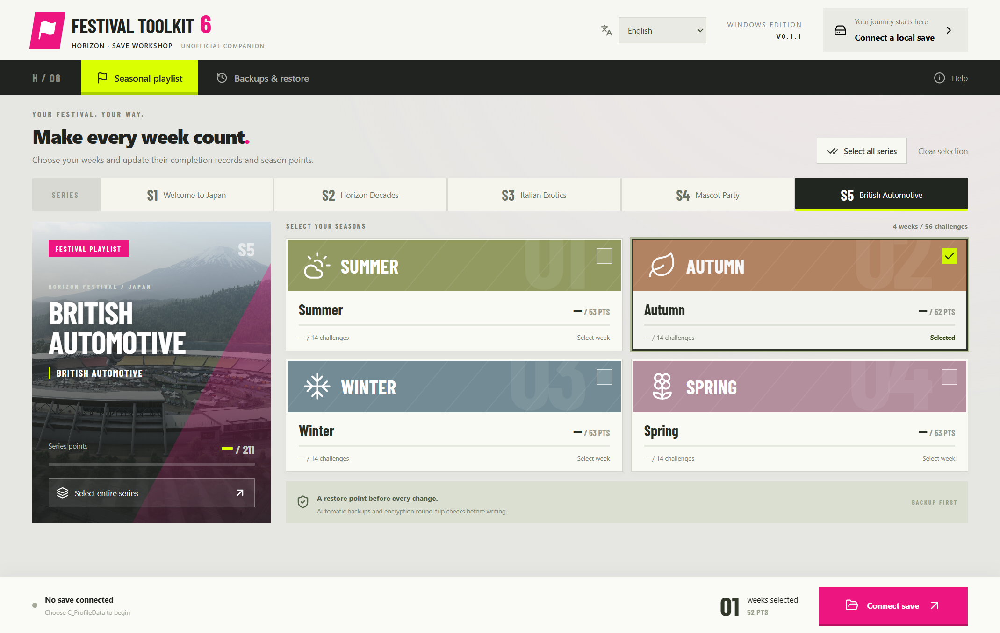

<a href="https://chefzc-homepage.vercel.app/gallery.html#project-festival-toolkit"></a>

<p align="center"><b>English</b> · <a href="README.zh-CN.md">简体中文</a></p>
<p align="center"><a href="https://github.com/ChefDavid0815/horizon-festival-toolkit/releases/tag/v0.1.1"><b>WINDOWS DOWNLOAD ↓</b></a> &nbsp; / &nbsp; <a href="https://chefzc-homepage.vercel.app/gallery.html#project-festival-toolkit">THE EXHIBITION ↗</a> &nbsp; / &nbsp; <a href="https://chefzc-homepage.vercel.app/post.html?article=festival-toolkit">BUILD JOURNAL ↗</a></p>

### `01` &nbsp; Every week. A little brighter.

**Horizon Festival Toolkit** is a Windows save workshop by **ChefZC**, built around FH6 seasonal records. Inspect a playlist, choose the weeks to work on, and keep a way back before writing changes.

The exhibition pairs mint green, sky blue and festival pink with the application's condensed type, angled labels and seasonal cards. Below is the actual application, with no save connected.



| 05 / Series | 20 / Weeks | 02 / Languages |
| :--- | :--- | :--- |
| Current catalogue: S1–S5 | Select a week, a series, or all recognised records | Chinese, English and system preference |

### `02` &nbsp; Inside the workshop

- Inspect recognised seasonal points and completion records.
- Apply changes to selected weeks, a series or every recognised week.
- Back up originals before writing. Handle an existing `C_ProfileData_SCopy` and restore each original file separately.
- Validate the decrypt/readback round trip before encrypted-save writes; verify backup integrity before restoration.
- Remember a manual language choice. Launching never automatically connects, modifies or restores saves.
- **No car-adding feature.** Seasonal modifications preserve the garage database bytes.

### `03` &nbsp; Before connecting a save

Current version: **0.1.1 / prerelease**, Windows x64 installer and portable app. Binaries are unsigned. Exit the game, choose `C_ProfileData`, then select the weeks. Only the explicit backup-and-apply action writes changes. Recovery points are available in the backup view; uninstalling preserves the app's backups.

**Data flow:** encrypted saves are sent to `forzamods.dev` by the bundled [ForzaCryptoTool](https://github.com/DVS-code/Forza-Crypto-Tool). The connection dialog explains this before use. Encrypted operations require network access and can fail if the upstream service or protocol changes. No account passwords or private API keys are embedded.

**Compatibility:** the catalogue comes from FH6 `2.440.853.0` resources. The parser accepts recognised FestivalPass v4 / schema `0x6efc7e34` only, and stops on unknown layouts. In-game loading, fully lit cards, independent challenge substates, reward delivery and online synchronisation remain unverified. Successful field writes do not establish every in-game effect.

This is a **native Windows desktop utility**. `npm run dev` starts the renderer development environment; save operations require Electron's native file bridge. There is no independently functional browser edition.

### `04` &nbsp; From source

Requires Node.js, npm and Windows. The repository includes application source, catalogue data, design assets and build configuration. Dependencies, private save fixtures and installer binaries stay outside Git history.

```powershell
git clone https://github.com/ChefDavid0815/horizon-festival-toolkit.git
cd horizon-festival-toolkit
npm ci
npm run build
npm start
```

For encrypted-save operations and complete Windows packaging, first install and verify the upstream executable described in [tools/README.md](tools/README.md). Then `npm run package` creates NSIS and portable builds.

Tests that need no private save fixture:

```powershell
New-Item -ItemType Directory -Force qa
node --test tests/service.test.cjs tests/settings.test.cjs
```

Full `npm test` and desktop QA require a developer-provided decrypted fixture at `qa/cli-roundtrip.bin`. That private file is not published. Tests use isolated temporary directories, not formal game saves. Publication validation: **build passed, 12/12 core tests passed**. Existing desktop verification covered installed/portable workflows and language persistence; those UI flows were not rerun during publication. See [verification notes](docs/VERIFICATION.md).

| Location | Purpose |
| :--- | :--- |
| `src/` | React UI, bilingual copy and Barlow Condensed type |
| `electron/` | Native IPC, save parser, transactional backup/recovery, language preferences |
| `data/` | Resource catalogues and third-party licences; no player saves |
| `scripts/`, `tests/` | Build tools and isolated verification |
| `docs/assets/` | Original exhibition cover and disconnected app screenshots |

### `05` &nbsp; Credits & editions

[Changelog](CHANGELOG.md) · [Third-party notices](THIRD_PARTY.md) · [ChefZC](https://github.com/ChefDavid0815)

An unofficial personal project, not affiliated with Microsoft, Xbox or Playground Games. Game names, photographs and resources belong to their respective owners. Third-party components keep their own licences; this repository grants no additional rights to them. Release downloads include SHA-256 checksums.

**YOUR FESTIVAL. YOUR WAY.**
