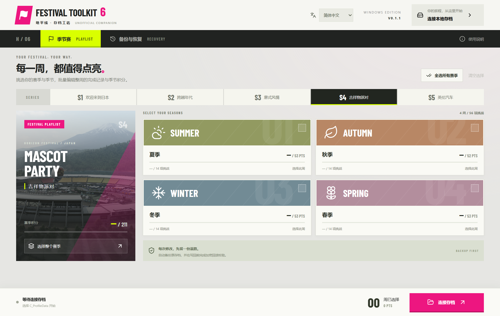

<a href="https://chefzc-homepage.vercel.app/gallery.html#project-festival-toolkit"></a>

<p align="center"><a href="README.md">English</a> · <b>简体中文</b></p>
<p align="center"><a href="https://github.com/ChefDavid0815/horizon-festival-toolkit/releases/tag/v0.1.1"><b>WINDOWS 下载 ↓</b></a> &nbsp; / &nbsp; <a href="https://chefzc-homepage.vercel.app/gallery.html#project-festival-toolkit">GALLERY ↗</a> &nbsp; / &nbsp; <a href="https://chefzc-homepage.vercel.app/post.html?article=festival-toolkit">制作手记 ↗</a></p>

### `01` &nbsp; 每一周，都值得点亮。

**Horizon Festival Toolkit** 是 ChefZC 制作的 FH6 季节赛存档工坊。查看记录、选定需要处理的周、在修改前留下备份，把几个步骤放进一个清楚的 Windows 界面。

展柜采用浅绿底、淡蓝与粉色，延续软件的凝缩字体、斜切标签和四季卡片。下面是软件本身的真实界面。



| 05 / 赛季 | 20 / 季节赛周 | 02 / 界面语言 |
| :--- | :--- | :--- |
| 当前目录 S1–S5 | 按周、按赛季、全选已识别记录 | 简体中文、English、跟随系统 |

### `02` &nbsp; 工坊里有什么

- 查看季节积分、活动完成记录及已识别的周。
- 选定某周、一个赛季，或全部已识别记录后修改。
- 写入之前备份原文件；已有的 `C_ProfileData_SCopy` 也纳入处理，恢复时分别还原各自原文件。
- 处理加密存档前做解密回读一致性校验；备份恢复前做完整性校验。
- 记住手动语言偏好。启动时不自动连接、修改或恢复存档。
- **不包含加车功能**，季节赛修改保持车库数据库字节不变。

### `03` &nbsp; 开始之前

当前版本为 **0.1.1 / 预发布**，提供 Windows x64 安装版和免安装版，未签名。先退出游戏，再选择 `C_ProfileData`。只有点击“备份并应用修改”才写回文件。备份页可查看恢复点；卸载不会删除应用备份。

**数据流：** 加密存档通过随附的 [ForzaCryptoTool](https://github.com/DVS-code/Forza-Crypto-Tool) 交给 `forzamods.dev` 在线处理，会上传所选文件。界面在连接前说明这一点。离线或服务变更可能导致加解密失败；不内置账号密码或私人 API 密钥。

**适配边界：** 目录基于 FH6 `2.440.853.0` 资源；仅处理已识别的 FestivalPass v4 / schema `0x6efc7e34`，未知布局停止。游戏实际读档、卡片全部发亮、独立挑战子状态、奖励发放与线上同步尚未验证。字段写入成功不等于全部游戏内效果已成立。

这是 **Windows 原生桌面工具**。`npm run dev` 只提供界面开发环境，存档功能依赖 Electron 的文件接口；没有可独立使用的网页版。

### `04` &nbsp; 从源码开始

需要 Node.js、npm 与 Windows。Git 中包含应用源码、目录数据、设计素材与构建配置；依赖、私人存档样本和安装包不进入源码历史。

```powershell
git clone https://github.com/ChefDavid0815/horizon-festival-toolkit.git
cd horizon-festival-toolkit
npm ci
npm run build
npm start
```

加密存档操作和完整打包需要先按 [tools/README.md](tools/README.md) 安装并核验上游工具，随后 `npm run package` 生成 NSIS 安装版与免安装版。

无需私人存档即可运行的测试：

```powershell
New-Item -ItemType Directory -Force qa
node --test tests/service.test.cjs tests/settings.test.cjs
```

完整 `npm test` 与桌面 QA 需要开发者自己提供 `qa/cli-roundtrip.bin`，这是不公开的解密测试副本。测试隔离目录与正式游戏存档分开。本次发布检查：**构建通过，12/12 核心测试通过**；已存在的桌面验证记录包含安装版、免安装版、语言切换与持久化，本次未重新执行桌面 UI 流程。见 [验证说明](docs/VERIFICATION.md)。

| 目录 | 内容 |
| :--- | :--- |
| `src/` | React 界面、双语文案、Barlow Condensed 字体 |
| `electron/` | 原生 IPC、存档解析、事务备份、恢复与语言偏好 |
| `data/` | 资源目录与第三方许可；不含玩家存档 |
| `scripts/`、`tests/` | 构建工具与隔离验证 |
| `docs/assets/` | 原创展柜封面与断开连接状态的软件截图 |

### `05` &nbsp; 来源与版本

[版本记录](CHANGELOG.md) · [第三方说明](THIRD_PARTY.md) · [ChefZC](https://github.com/ChefDavid0815)

个人非官方项目，与 Microsoft、Xbox、Playground Games 无隶属关系。游戏名称、摄影和资源归原权利人所有；第三方组件保留各自许可。本仓库不为这些内容授予额外权利。发布文件的 SHA-256 校验和随版本提供。

**YOUR FESTIVAL. YOUR WAY.**
